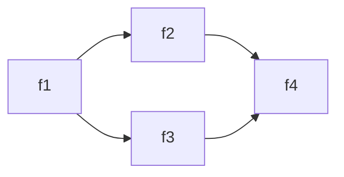

# WhoCalled

Show function calls as a tree.

This module is a tool to determine dependencies at the function level. If you want to make a change in a function, this can tell you what other functions need to be changed.

## Example

### Finding calls made by a function

If you have a module called `Diamond` that looks like this:

```powershell
# Diamond.psm1
function f1 {
    f2
    f3
}
function f2 {
    f4
}
function f3 {
    f4
}
function f4 {
}
```

...then we would say that `f2` calls `f4`. If you rename a parameter in `f4`, then you may need to also update `f2`.

`WhoCalled` can help with this.

The structure of calls in the module is as follows:



And we can see what calls are made by `f1`, recursively, using `Find-Call`:

```
> 'f1' | Find-Call

CommandType Name   Version Source
----------- ----   ------- ------
Function    f1     0.0     Diamond
Function      f2   0.0     Diamond
Function        f4 0.0     Diamond
Function      f3   0.0     Diamond
Function        f4 0.0     Diamond
```

### Finding calls made to a function

It's usually easy enough to see what calls a function makes simply by inspecting the code. But what if we want to see what other functions call some given function, recursively? Usually, we would have to do this with a text search. But we can now do this with `Find-Caller`:

```
> 'f4' | Find-Caller -Module Diamond

CommandType Name   Version Source
----------- ----   ------- ------
Function    f4     0.0     Diamond
Function      f2   0.0     Diamond
Function        f1 0.0     Diamond
Function      f3   0.0     Diamond
Function        f1 0.0     Diamond
```

`WhoCalled` works across module boundaries. See the [examples](https://github.com/fsackur/WhoCalled/blob/main/Tests/Assets/mermaid.md) for more complicated module structures.

### Finding the files where functions are defined

`WhoCalled` outputs function objects, so you can get the files that define them form the `ScriptBlock` property:

```
> Find-Call 'Find-Call' | Format-Table Name, {$_.ScriptBlock.File}

Name                        $_.ScriptBlock.File
----                        -------------------
Find-Call                   C:\gitroot\WhoCalled\Public\Find-Call.ps1
Find-CallNameFromDefinition C:\gitroot\WhoCalled\Private\Find-CallNameFromDefinition.ps1
Resolve-Command             C:\gitroot\WhoCalled\Private\Resolve-Command.ps1
```

> Technically, these are not function objects. They behave like them, but can't be passed to commands that expect `CommandInfo` or `FunctionInfo`.

To open all the source files in VS Code:

```
code (Find-Call 'Find-Call' | ForEach-Object {$_.ScriptBlock.File})
```

## Features

- Works across modules
- Parses public (exported) and private (non-exported) functions
- Excludes default modules (i.e. Microsoft modules that ship with PowerShell) by default
- Resolves aliases

## Limitations

- Reports on calls to cmdlets, but does not parse cmdlets for calls made by them
- Modules must be imported (if not, `WhoCalled` will import them automatically)

## Installation

Install `WhoCalled` from the PowerShell Gallery:

```powershell
Install-Module WhoCalled
```

Alternatively, using PowerShellGet 3:

```powershell
Install-PSResource WhoCalled
```
