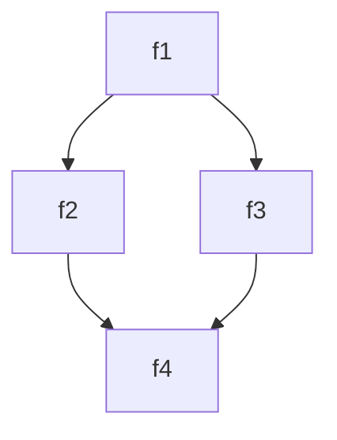

# Test declarations

Developed in `VS Code` with the `bierner.markdown-mermaid` extension.

## Diamond



### Invocation

```powershell
'f1' | Find-Call
```

### Output

```
CommandType Name   Version Source
----------- ----   ------- ------
Function    f1     0.0     Diamond
Function      f2   0.0     Diamond
Function        f4 0.0     Diamond
Function      f3   0.0     Diamond
Function        f4 0.0     Diamond
```
