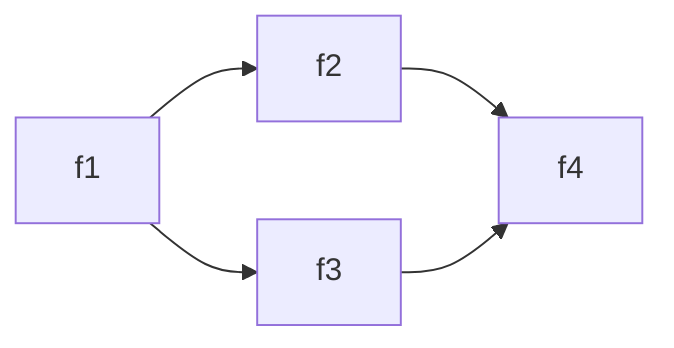
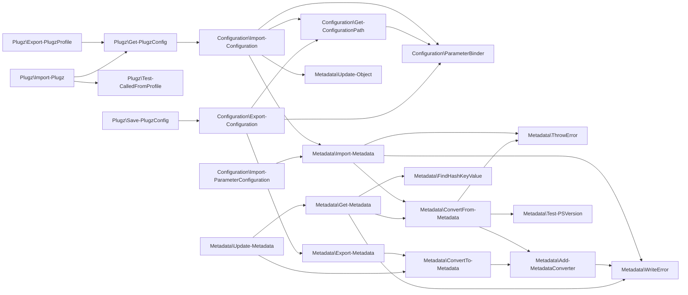

# Test declarations

_Developed in `VS Code` with the `bierner.markdown-mermaid` extension._

<!-- See Import-TestCase.ps1 for formatting guidance and limitations -->

## Diamond



```
> 'f1' | Find-Call

CommandType Name   Version Source
----------- ----   ------- ------
Function    f1     0.0     Diamond
Function      f2   0.0     Diamond
Function        f4 0.0     Diamond
Function      f3   0.0     Diamond
Function        f4 0.0     Diamond
```

```
> 'f4' | Find-Caller -Module Diamond

CommandType Name   Version Source
----------- ----   ------- ------
Function    f4     0.0     Diamond
Function      f2   0.0     Diamond
Function        f1 0.0     Diamond
Function      f3   0.0     Diamond
Function        f1 0.0     Diamond
```

## Three Modules



```
> Find-Call Import-Plugz -Depth 5

CommandType Name                            Version Source
----------- ----                            ------- ------
Function    Import-Plugz                    0.2.0   Plugz
Function      Get-PlugzConfig               0.2.0   Plugz
Function        Import-Configuration        1.5.1   Configuration
Function          Get-ConfigurationPath     1.5.1   Configuration
Function            ParameterBinder         1.5.1   Configuration
Function          Import-Metadata           1.5.3   Metadata
Function            ConvertFrom-Metadata    1.5.3   Metadata
Function              Add-MetadataConverter 1.5.3   Metadata
Function              Test-PSVersion        1.5.3   Metadata
Function              ThrowError            1.5.3   Metadata
Function            ThrowError              1.5.3   Metadata
Function            WriteError              1.5.3   Metadata
Function          ParameterBinder           1.5.1   Configuration
Function          Update-Object             1.5.3   Metadata
Function      Test-CalledFromProfile        0.2.0   Plugz
```

## PowerShellGet

```mermaid
graph LR;
    PowerShellGet\Find-Command-->PowerShellGet\Find-Module;
    PowerShellGet\Find-DscResource-->PowerShellGet\Find-Module;
    PowerShellGet\Find-Module-->PackageManagement\Find-Package;
    PowerShellGet\Find-Module-->PowerShellGet\Get-PSRepository;
    PowerShellGet\Find-Module-->PowerShellGet\Install-NuGetClientBinaries;
    PowerShellGet\Find-Module-->PowerShellGet\Log-ArtifactNotFoundInPSGallery;
    PowerShellGet\Find-Module-->PowerShellGet\New-PSGetItemInfo;
    PowerShellGet\Find-Module-->PowerShellGet\Test-WildcardPattern;
    PowerShellGet\Find-Module-->PowerShellGet\Validate-VersionParameters;
    PowerShellGet\Find-RoleCapability-->PowerShellGet\Find-Module;
    PowerShellGet\Find-Script-->PackageManagement\Find-Package;
    PowerShellGet\Find-Script-->PowerShellGet\Get-PSRepository;
    PowerShellGet\Find-Script-->PowerShellGet\Install-NuGetClientBinaries;
    PowerShellGet\Find-Script-->PowerShellGet\Log-ArtifactNotFoundInPSGallery;
    PowerShellGet\Find-Script-->PowerShellGet\New-PSGetItemInfo;
    PowerShellGet\Find-Script-->PowerShellGet\Test-WildcardPattern;
    PowerShellGet\Find-Script-->PowerShellGet\Validate-VersionParameters;
    PowerShellGet\Get-AvailableRoleCapabilityName-->PowerShellGet\Join-PathUtility;
    PowerShellGet\Get-AvailableScriptFilePath-->PowerShellGet\Test-WildcardPattern;
    PowerShellGet\Get-DynamicParameters-->PackageManagement\Get-PackageProvider;
    PowerShellGet\Get-DynamicParameters-->PackageManagement\Get-PackageSource;
    PowerShellGet\Get-DynamicParameters-->PowerShellGet\Get-LocationString;
    PowerShellGet\Get-DynamicParameters-->PowerShellGet\Get-PackageManagementProviderName;
    PowerShellGet\Get-DynamicParameters-->PowerShellGet\Resolve-Location;
    PowerShellGet\Get-ExportedDscResources-->PowerShellGet\Join-PathUtility;
    PowerShellGet\Get-ExportedDscResources-->PSDesiredStateConfiguration\Get-DscResource;
    PowerShellGet\Get-InstallationScope-->PowerShellGet\Test-RunningAsElevated;
    PowerShellGet\Get-InstalledModule-->PackageManagement\Get-Package;
    PowerShellGet\Get-InstalledModule-->PowerShellGet\New-PSGetItemInfo;
    PowerShellGet\Get-InstalledModule-->PowerShellGet\Validate-VersionParameters;
    PowerShellGet\Get-InstalledScript-->PackageManagement\Get-Package;
    PowerShellGet\Get-InstalledScript-->PowerShellGet\New-PSGetItemInfo;
    PowerShellGet\Get-InstalledScript-->PowerShellGet\Validate-VersionParameters;
    PowerShellGet\Get-InstalledScriptFilePath-->PowerShellGet\Get-AvailableScriptFilePath;
    PowerShellGet\Get-InstalledScriptFilePath-->PowerShellGet\Test-ScriptInstalled;
    PowerShellGet\Get-ModuleDependencies-->PowerShellGet\Get-ManifestHashTable;
    PowerShellGet\Get-ModuleDependencies-->PowerShellGet\ValidateAndGet-RequiredModuleDetails;
    PowerShellGet\Get-PackageManagementProviderName-->PackageManagement\Get-PackageProvider;
    PowerShellGet\Get-PackageManagementProviderName-->PackageManagement\Get-PackageSource;
    PowerShellGet\Get-PackageManagementProviderName-->PowerShellGet\Get-LocationString;
    PowerShellGet\Get-PSRepository-->PackageManagement\Get-PackageSource;
    PowerShellGet\Get-PSRepository-->PowerShellGet\New-ModuleSourceFromPackageSource;
    PowerShellGet\Get-SourceLocation-->PowerShellGet\Set-ModuleSourcesVariable;
    PowerShellGet\Get-SourceName-->PowerShellGet\Set-ModuleSourcesVariable;
    PowerShellGet\Get-SourceName-->PowerShellGet\Test-EquivalentLocation;
    PowerShellGet\Install-Module-->PackageManagement\Install-Package;
    PowerShellGet\Install-Module-->PowerShellGet\Get-ProviderName;
    PowerShellGet\Install-Module-->PowerShellGet\Get-PSRepository;
    PowerShellGet\Install-Module-->PowerShellGet\Install-NuGetClientBinaries;
    PowerShellGet\Install-Module-->PowerShellGet\New-PSGetItemInfo;
    PowerShellGet\Install-Module-->PowerShellGet\Test-ModuleInstalled;
    PowerShellGet\Install-Module-->PowerShellGet\Test-RunningAsElevated;
    PowerShellGet\Install-Module-->PowerShellGet\ThrowError;
    PowerShellGet\Install-Module-->PowerShellGet\Validate-VersionParameters;
    PowerShellGet\Install-NuGetClientBinaries-->PackageManagement\Get-PackageProvider;
    PowerShellGet\Install-NuGetClientBinaries-->PackageManagement\Import-PackageProvider;
    PowerShellGet\Install-NuGetClientBinaries-->PackageManagement\Install-PackageProvider;
    PowerShellGet\Install-NuGetClientBinaries-->PowerShellGet\Get-ParametersHashtable;
    PowerShellGet\Install-NuGetClientBinaries-->PowerShellGet\Test-RunningAsElevated;
    PowerShellGet\Install-NuGetClientBinaries-->PowerShellGet\ThrowError;
    PowerShellGet\Install-Script-->PackageManagement\Install-Package;
    PowerShellGet\Install-Script-->PowerShellGet\Get-ProviderName;
    PowerShellGet\Install-Script-->PowerShellGet\Get-PSRepository;
    PowerShellGet\Install-Script-->PowerShellGet\Install-NuGetClientBinaries;
    PowerShellGet\Install-Script-->PowerShellGet\New-PSGetItemInfo;
    PowerShellGet\Install-Script-->PowerShellGet\Test-RunningAsElevated;
    PowerShellGet\Install-Script-->PowerShellGet\Test-ScriptInstalled;
    PowerShellGet\Install-Script-->PowerShellGet\ThrowError;
    PowerShellGet\Install-Script-->PowerShellGet\Validate-VersionParameters;
    PowerShellGet\Install-Script-->PowerShellGet\ValidateAndSet-PATHVariableIfUserAccepts;
    PowerShellGet\Log-ArtifactNotFoundInPSGallery-->PowerShellGet\Test-WildcardPattern;
    PowerShellGet\New-PSGetItemInfo-->PowerShellGet\Get-EntityName;
    PowerShellGet\New-PSGetItemInfo-->PowerShellGet\Get-First;
    PowerShellGet\New-PSGetItemInfo-->PowerShellGet\Get-SourceLocation;
    PowerShellGet\New-PSGetItemInfo-->PowerShellGet\Get-SourceName;
    PowerShellGet\New-PSGetItemInfo-->PowerShellGet\Get-UrlFromSwid;
    PowerShellGet\New-ScriptFileInfo-->PowerShellGet\Get-EnvironmentVariable;
    PowerShellGet\New-ScriptFileInfo-->PowerShellGet\Get-PSScriptInfoString;
    PowerShellGet\New-ScriptFileInfo-->PowerShellGet\Get-RequiresString;
    PowerShellGet\New-ScriptFileInfo-->PowerShellGet\Get-ScriptCommentHelpInfoString;
    PowerShellGet\New-ScriptFileInfo-->PowerShellGet\Test-ScriptFileInfo;
    PowerShellGet\New-ScriptFileInfo-->PowerShellGet\ThrowError;
    PowerShellGet\New-ScriptFileInfo-->PowerShellGet\Validate-ScriptFileInfoParameters;
    PowerShellGet\New-ScriptFileInfo-->PowerShellGet\ValidateAndGet-VersionPrereleaseStrings;
    PowerShellGet\Ping-Endpoint-->PowerShellGet\HttpClientApisAvailable;
    PowerShellGet\Publish-Module-->PowerShellGet\Compare-PrereleaseVersions;
    PowerShellGet\Publish-Module-->PowerShellGet\Find-Module;
    PowerShellGet\Publish-Module-->PowerShellGet\Find-Script;
    PowerShellGet\Publish-Module-->PowerShellGet\Get-ProviderName;
    PowerShellGet\Publish-Module-->PowerShellGet\Get-PSRepository;
    PowerShellGet\Publish-Module-->PowerShellGet\Install-NuGetClientBinaries;
    PowerShellGet\Publish-Module-->PowerShellGet\Join-PathUtility;
    PowerShellGet\Publish-Module-->PowerShellGet\Publish-PSArtifactUtility;
    PowerShellGet\Publish-Module-->PowerShellGet\Resolve-PathHelper;
    PowerShellGet\Publish-Module-->PowerShellGet\Test-WebUri;
    PowerShellGet\Publish-Module-->PowerShellGet\ThrowError;
    PowerShellGet\Publish-Module-->PowerShellGet\Validate-VersionParameters;
    PowerShellGet\Publish-Module-->PowerShellGet\ValidateAndGet-VersionPrereleaseStrings;
    PowerShellGet\Publish-PSArtifactUtility-->PowerShellGet\Get-AvailableRoleCapabilityName;
    PowerShellGet\Publish-PSArtifactUtility-->PowerShellGet\Get-ExportedDscResources;
    PowerShellGet\Publish-PSArtifactUtility-->PowerShellGet\Get-ManifestHashTable;
    PowerShellGet\Publish-PSArtifactUtility-->PowerShellGet\Get-ModuleDependencies;
    PowerShellGet\Publish-PSArtifactUtility-->PowerShellGet\Install-NuGetClientBinaries;
    PowerShellGet\Publish-PSArtifactUtility-->PowerShellGet\Join-PathUtility;
    PowerShellGet\Publish-PSArtifactUtility-->PowerShellGet\New-NugetPackage;
    PowerShellGet\Publish-PSArtifactUtility-->PowerShellGet\New-NuspecFile;
    PowerShellGet\Publish-PSArtifactUtility-->PowerShellGet\Publish-NugetPackage;
    PowerShellGet\Publish-PSArtifactUtility-->PowerShellGet\ThrowError;
    PowerShellGet\Publish-PSArtifactUtility-->PowerShellGet\ValidateAndGet-ScriptDependencies;
    PowerShellGet\Publish-Script-->PowerShellGet\Compare-PrereleaseVersions;
    PowerShellGet\Publish-Script-->PowerShellGet\Find-Module;
    PowerShellGet\Publish-Script-->PowerShellGet\Find-Script;
    PowerShellGet\Publish-Script-->PowerShellGet\Get-ProviderName;
    PowerShellGet\Publish-Script-->PowerShellGet\Get-PSRepository;
    PowerShellGet\Publish-Script-->PowerShellGet\Install-NuGetClientBinaries;
    PowerShellGet\Publish-Script-->PowerShellGet\Publish-PSArtifactUtility;
    PowerShellGet\Publish-Script-->PowerShellGet\Resolve-PathHelper;
    PowerShellGet\Publish-Script-->PowerShellGet\Test-ScriptFileInfo;
    PowerShellGet\Publish-Script-->PowerShellGet\Test-WebUri;
    PowerShellGet\Publish-Script-->PowerShellGet\ThrowError;
    PowerShellGet\Publish-Script-->PowerShellGet\ValidateAndGet-VersionPrereleaseStrings;
    PowerShellGet\Register-PSRepository-->\nuget;
    PowerShellGet\Register-PSRepository-->PackageManagement\Get-PackageProvider;
    PowerShellGet\Register-PSRepository-->PackageManagement\Register-PackageSource;
    PowerShellGet\Register-PSRepository-->PowerShellGet\Get-CredsFromCredentialProvider;
    PowerShellGet\Register-PSRepository-->PowerShellGet\Get-DynamicParameters;
    PowerShellGet\Register-PSRepository-->PowerShellGet\Get-LocationString;
    PowerShellGet\Register-PSRepository-->PowerShellGet\Get-PackageManagementProviderName;
    PowerShellGet\Register-PSRepository-->PowerShellGet\Install-NuGetClientBinaries;
    PowerShellGet\Register-PSRepository-->PowerShellGet\Ping-Endpoint;
    PowerShellGet\Register-PSRepository-->PowerShellGet\Resolve-Location;
    PowerShellGet\Register-PSRepository-->PowerShellGet\ThrowError;
    PowerShellGet\Resolve-Location-->PowerShellGet\Ping-Endpoint;
    PowerShellGet\Resolve-Location-->PowerShellGet\Test-WebUri;
    PowerShellGet\Resolve-Location-->PowerShellGet\ThrowError;
    PowerShellGet\Resolve-PathHelper-->PowerShellGet\ThrowError;
    PowerShellGet\Save-Module-->PackageManagement\Save-Package;
    PowerShellGet\Save-Module-->PowerShellGet\Get-ProviderName;
    PowerShellGet\Save-Module-->PowerShellGet\Get-PSRepository;
    PowerShellGet\Save-Module-->PowerShellGet\Install-NuGetClientBinaries;
    PowerShellGet\Save-Module-->PowerShellGet\Resolve-PathHelper;
    PowerShellGet\Save-Module-->PowerShellGet\ThrowError;
    PowerShellGet\Save-Module-->PowerShellGet\Validate-VersionParameters;
    PowerShellGet\Save-Script-->PackageManagement\Save-Package;
    PowerShellGet\Save-Script-->PowerShellGet\Get-ProviderName;
    PowerShellGet\Save-Script-->PowerShellGet\Get-PSRepository;
    PowerShellGet\Save-Script-->PowerShellGet\Install-NuGetClientBinaries;
    PowerShellGet\Save-Script-->PowerShellGet\Resolve-PathHelper;
    PowerShellGet\Save-Script-->PowerShellGet\ThrowError;
    PowerShellGet\Save-Script-->PowerShellGet\Validate-VersionParameters;
    PowerShellGet\Set-EnvironmentVariable-->PowerShellGet\Send-EnvironmentChangeMessage;
    PowerShellGet\Set-EnvironmentVariable-->PowerShellGet\ThrowError;
    PowerShellGet\Set-ModuleSourcesVariable-->PowerShellGet\DeSerialize-PSObject;
    PowerShellGet\Set-ModuleSourcesVariable-->PowerShellGet\Get-PublishLocation;
    PowerShellGet\Set-ModuleSourcesVariable-->PowerShellGet\Get-ScriptSourceLocation;
    PowerShellGet\Set-ModuleSourcesVariable-->PowerShellGet\Save-ModuleSources;
    PowerShellGet\Set-ModuleSourcesVariable-->PowerShellGet\Set-PSGalleryRepository;
    PowerShellGet\Set-PSGetSettingsVariable-->PowerShellGet\DeSerialize-PSObject;
    PowerShellGet\Set-PSRepository-->PackageManagement\Get-PackageProvider;
    PowerShellGet\Set-PSRepository-->PackageManagement\Set-PackageSource;
    PowerShellGet\Set-PSRepository-->PowerShellGet\Get-DynamicParameters;
    PowerShellGet\Set-PSRepository-->PowerShellGet\Get-LocationString;
    PowerShellGet\Set-PSRepository-->PowerShellGet\Get-ProviderName;
    PowerShellGet\Set-PSRepository-->PowerShellGet\Get-PSRepository;
    PowerShellGet\Set-PSRepository-->PowerShellGet\Install-NuGetClientBinaries;
    PowerShellGet\Set-PSRepository-->PowerShellGet\Resolve-Location;
    PowerShellGet\Set-PSRepository-->PowerShellGet\ThrowError;
    PowerShellGet\Test-ItemPrereleaseVersionRequirements-->PowerShellGet\Compare-PrereleaseVersions;
    PowerShellGet\Test-ItemPrereleaseVersionRequirements-->PowerShellGet\ValidateAndGet-VersionPrereleaseStrings;
    PowerShellGet\Test-ModuleInstalled-->PowerShellGet\Test-ItemPrereleaseVersionRequirements;
    PowerShellGet\Test-ModuleInstalled-->PowerShellGet\Test-ModuleSxSVersionSupport;
    PowerShellGet\Test-ScriptFileInfo-->PowerShellGet\Get-OrderedPSScriptInfoObject;
    PowerShellGet\Test-ScriptFileInfo-->PowerShellGet\New-PSScriptInfoObject;
    PowerShellGet\Test-ScriptFileInfo-->PowerShellGet\Resolve-PathHelper;
    PowerShellGet\Test-ScriptFileInfo-->PowerShellGet\ThrowError;
    PowerShellGet\Test-ScriptFileInfo-->PowerShellGet\ValidateAndAdd-PSScriptInfoEntry;
    PowerShellGet\Test-ScriptFileInfo-->PowerShellGet\ValidateAndGet-VersionPrereleaseStrings;
    PowerShellGet\Test-ScriptInstalled-->PowerShellGet\New-PSScriptInfoObject;
    PowerShellGet\Test-ScriptInstalled-->PowerShellGet\Test-ScriptFileInfo;
    PowerShellGet\Test-ScriptInstalled-->PowerShellGet\ValidateAndGet-VersionPrereleaseStrings;
    PowerShellGet\Uninstall-Module-->PackageManagement\Uninstall-Package;
    PowerShellGet\Uninstall-Module-->PowerShellGet\ThrowError;
    PowerShellGet\Uninstall-Module-->PowerShellGet\Validate-VersionParameters;
    PowerShellGet\Uninstall-Script-->PackageManagement\Uninstall-Package;
    PowerShellGet\Uninstall-Script-->PowerShellGet\ThrowError;
    PowerShellGet\Uninstall-Script-->PowerShellGet\Validate-VersionParameters;
    PowerShellGet\Unregister-PSRepository-->\nuget;
    PowerShellGet\Unregister-PSRepository-->PackageManagement\Unregister-PackageSource;
    PowerShellGet\Unregister-PSRepository-->PowerShellGet\Test-WildcardPattern;
    PowerShellGet\Update-Module-->PackageManagement\Get-Package;
    PowerShellGet\Update-Module-->PackageManagement\Install-Package;
    PowerShellGet\Update-Module-->PowerShellGet\Get-InstallationScope;
    PowerShellGet\Update-Module-->PowerShellGet\Get-ProviderName;
    PowerShellGet\Update-Module-->PowerShellGet\Install-NuGetClientBinaries;
    PowerShellGet\Update-Module-->PowerShellGet\New-PSGetItemInfo;
    PowerShellGet\Update-Module-->PowerShellGet\Test-RunningAsElevated;
    PowerShellGet\Update-Module-->PowerShellGet\Test-WildcardPattern;
    PowerShellGet\Update-Module-->PowerShellGet\ThrowError;
    PowerShellGet\Update-Module-->PowerShellGet\Validate-VersionParameters;
    PowerShellGet\Update-ModuleManifest-->PowerShellGet\Get-ManifestHashTable;
    PowerShellGet\Update-ModuleManifest-->PowerShellGet\Get-PrivateData;
    PowerShellGet\Update-ModuleManifest-->PowerShellGet\ThrowError;
    PowerShellGet\Update-ModuleManifest-->PowerShellGet\ValidateAndGet-VersionPrereleaseStrings;
    PowerShellGet\Update-Script-->PackageManagement\Install-Package;
    PowerShellGet\Update-Script-->PowerShellGet\DeSerialize-PSObject;
    PowerShellGet\Update-Script-->PowerShellGet\Get-AvailableScriptFilePath;
    PowerShellGet\Update-Script-->PowerShellGet\Get-InstallationScope;
    PowerShellGet\Update-Script-->PowerShellGet\Get-InstalledScriptFilePath;
    PowerShellGet\Update-Script-->PowerShellGet\Get-ProviderName;
    PowerShellGet\Update-Script-->PowerShellGet\Install-NuGetClientBinaries;
    PowerShellGet\Update-Script-->PowerShellGet\New-PSGetItemInfo;
    PowerShellGet\Update-Script-->PowerShellGet\Test-WildcardPattern;
    PowerShellGet\Update-Script-->PowerShellGet\Validate-VersionParameters;
    PowerShellGet\Update-ScriptFileInfo-->PowerShellGet\Get-EnvironmentVariable;
    PowerShellGet\Update-ScriptFileInfo-->PowerShellGet\Get-PSScriptInfoString;
    PowerShellGet\Update-ScriptFileInfo-->PowerShellGet\Get-RequiresString;
    PowerShellGet\Update-ScriptFileInfo-->PowerShellGet\Get-ScriptCommentHelpInfoString;
    PowerShellGet\Update-ScriptFileInfo-->PowerShellGet\Resolve-PathHelper;
    PowerShellGet\Update-ScriptFileInfo-->PowerShellGet\Test-ScriptFileInfo;
    PowerShellGet\Update-ScriptFileInfo-->PowerShellGet\ThrowError;
    PowerShellGet\Update-ScriptFileInfo-->PowerShellGet\Validate-ScriptFileInfoParameters;
    PowerShellGet\Update-ScriptFileInfo-->PowerShellGet\ValidateAndGet-VersionPrereleaseStrings;
    PowerShellGet\Validate-VersionParameters-->PowerShellGet\Compare-PrereleaseVersions;
    PowerShellGet\Validate-VersionParameters-->PowerShellGet\Test-WildcardPattern;
    PowerShellGet\Validate-VersionParameters-->PowerShellGet\ThrowError;
    PowerShellGet\Validate-VersionParameters-->PowerShellGet\ValidateAndGet-VersionPrereleaseStrings;
    PowerShellGet\ValidateAndAdd-PSScriptInfoEntry-->PowerShellGet\Test-WebUri;
    PowerShellGet\ValidateAndAdd-PSScriptInfoEntry-->PowerShellGet\ThrowError;
    PowerShellGet\ValidateAndAdd-PSScriptInfoEntry-->PowerShellGet\ValidateAndGet-VersionPrereleaseStrings;
    PowerShellGet\ValidateAndGet-NuspecVersionString-->PowerShellGet\ThrowError;
    PowerShellGet\ValidateAndGet-RequiredModuleDetails-->PowerShellGet\Find-Module;
    PowerShellGet\ValidateAndGet-RequiredModuleDetails-->PowerShellGet\Get-ExternalModuleDependencies;
    PowerShellGet\ValidateAndGet-RequiredModuleDetails-->PowerShellGet\ThrowError;
    PowerShellGet\ValidateAndGet-ScriptDependencies-->PowerShellGet\Find-Module;
    PowerShellGet\ValidateAndGet-ScriptDependencies-->PowerShellGet\Find-Script;
    PowerShellGet\ValidateAndGet-ScriptDependencies-->PowerShellGet\ThrowError;
    PowerShellGet\ValidateAndGet-ScriptDependencies-->PowerShellGet\ValidateAndGet-NuspecVersionString;
    PowerShellGet\ValidateAndGet-VersionPrereleaseStrings-->PowerShellGet\ThrowError;
    PowerShellGet\ValidateAndSet-PATHVariableIfUserAccepts-->PowerShellGet\Get-EnvironmentVariable;
    PowerShellGet\ValidateAndSet-PATHVariableIfUserAccepts-->PowerShellGet\Save-PSGetSettings;
    PowerShellGet\ValidateAndSet-PATHVariableIfUserAccepts-->PowerShellGet\Set-EnvironmentVariable;
    PowerShellGet\ValidateAndSet-PATHVariableIfUserAccepts-->PowerShellGet\Set-PSGetSettingsVariable;
    PSDesiredStateConfiguration\Get-DscResource-->PSDesiredStateConfiguration\Get-PSImplicitRemotingClientSideParameters;
    PSDesiredStateConfiguration\Get-DscResource-->PSDesiredStateConfiguration\Get-PSImplicitRemotingSession;
```

```
> Find-Call Install-Module

CommandType Name                                          Version Source
----------- ----                                          ------- ------
Function    Install-Module                                2.2.5   PowerShellGet
Function      Get-ProviderName                            2.2.5   PowerShellGet
Function      Get-PSRepository                            2.2.5   PowerShellGet
Cmdlet          Get-PackageSource                         1.4.7   PackageManagement
Function        New-ModuleSourceFromPackageSource         2.2.5   PowerShellGet
Function      Install-NuGetClientBinaries                 2.2.5   PowerShellGet
Cmdlet          Get-PackageProvider                       1.4.7   PackageManagement
Function        Get-ParametersHashtable                   2.2.5   PowerShellGet
Cmdlet          Import-PackageProvider                    1.4.7   PackageManagement
Cmdlet          Install-PackageProvider                   1.4.7   PackageManagement
Function        Test-RunningAsElevated                    2.2.5   PowerShellGet
Function        ThrowError                                2.2.5   PowerShellGet
Cmdlet        Install-Package                             1.4.7   PackageManagement
Function      New-PSGetItemInfo                           2.2.5   PowerShellGet
Function        Get-EntityName                            2.2.5   PowerShellGet
Function        Get-First                                 2.2.5   PowerShellGet
Function        Get-SourceLocation                        2.2.5   PowerShellGet
Function          Set-ModuleSourcesVariable               2.2.5   PowerShellGet
Function            DeSerialize-PSObject                  2.2.5   PowerShellGet
Function            Get-PublishLocation                   2.2.5   PowerShellGet
Function            Get-ScriptSourceLocation              2.2.5   PowerShellGet
Function            Save-ModuleSources                    2.2.5   PowerShellGet
Function            Set-PSGalleryRepository               2.2.5   PowerShellGet
Function        Get-SourceName                            2.2.5   PowerShellGet
Function          Set-ModuleSourcesVariable               2.2.5   PowerShellGet
Function          Test-EquivalentLocation                 2.2.5   PowerShellGet
Function        Get-UrlFromSwid                           2.2.5   PowerShellGet
Function      Test-ModuleInstalled                        2.2.5   PowerShellGet
Function        Test-ItemPrereleaseVersionRequirements    2.2.5   PowerShellGet
Function          Compare-PrereleaseVersions              2.2.5   PowerShellGet
Function          ValidateAndGet-VersionPrereleaseStrings 2.2.5   PowerShellGet
Function            ThrowError                            2.2.5   PowerShellGet
Function        Test-ModuleSxSVersionSupport              2.2.5   PowerShellGet
Function      Test-RunningAsElevated                      2.2.5   PowerShellGet
Function      ThrowError                                  2.2.5   PowerShellGet
Function      Validate-VersionParameters                  2.2.5   PowerShellGet
Function        Compare-PrereleaseVersions                2.2.5   PowerShellGet
Function        Test-WildcardPattern                      2.2.5   PowerShellGet
Function        ThrowError                                2.2.5   PowerShellGet
Function        ValidateAndGet-VersionPrereleaseStrings   2.2.5   PowerShellGet
```

```
> Find-Caller Get-ModuleDependencies -Module PowerShellGet, PackageManagement

CommandType Name                        Version Source
----------- ----                        ------- ------
Function    Get-ModuleDependencies      2.2.5   PowerShellGet
Function      Publish-PSArtifactUtility 2.2.5   PowerShellGet
Function        Publish-Module          2.2.5   PowerShellGet
Function        Publish-Script          2.2.5   PowerShellGet
```
