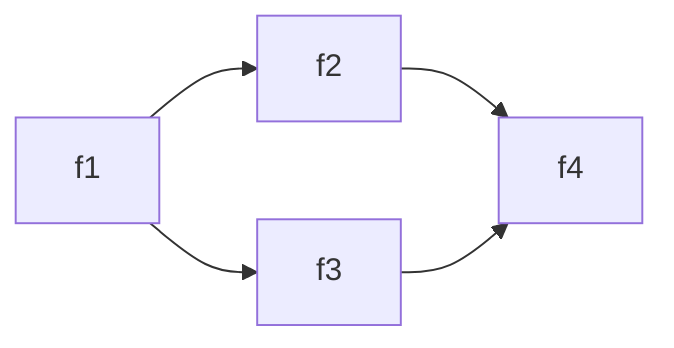
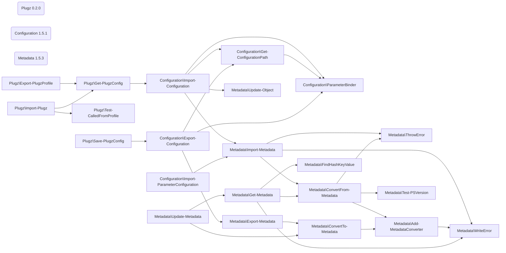
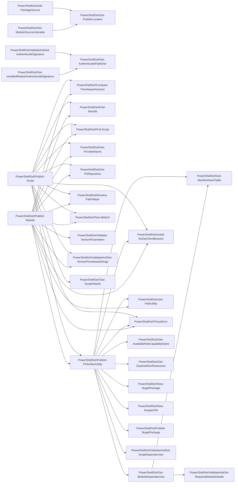

# Test declarations

_Developed in `VS Code` with the `bierner.markdown-mermaid` extension._

<!-- See Parse-Mermaid.ps1 for formatting guidance and limitations -->

## Diamond



```
> 'f1' | Find-Call

CommandType Name   Version Source
----------- ----   ------- ------
Function    f1     0.0     Diamond
Function      f2   0.0     Diamond
Function        f4 0.0     Diamond
Function      f3   0.0     Diamond
Function        f4 0.0     Diamond
```

```
> 'f4' | Find-Caller -Module Diamond

CommandType Name   Version Source
----------- ----   ------- ------
Function    f4     0.0     Diamond
Function      f2   0.0     Diamond
Function        f1 0.0     Diamond
Function      f3   0.0     Diamond
Function        f1 0.0     Diamond
```

## Three Modules



```
> Find-Call Import-Plugz -Depth 5

CommandType Name                            Version Source
----------- ----                            ------- ------
Function    Import-Plugz                    0.2.0   Plugz
Function      Get-PlugzConfig               0.2.0   Plugz
Function        Import-Configuration        1.5.1   Configuration
Function          Get-ConfigurationPath     1.5.1   Configuration
Function            ParameterBinder         1.5.1   Configuration
Function          Import-Metadata           1.5.3   Metadata
Function            ConvertFrom-Metadata    1.5.3   Metadata
Function              Add-MetadataConverter 1.5.3   Metadata
Function              Test-PSVersion        1.5.3   Metadata
Function              ThrowError            1.5.3   Metadata
Function            ThrowError              1.5.3   Metadata
Function            WriteError              1.5.3   Metadata
Function          ParameterBinder           1.5.1   Configuration
Function          Update-Object             1.5.3   Metadata
Function      Test-CalledFromProfile        0.2.0   Plugz
```

## PowerShellGet



```
> Find-Call Install-Module

CommandType Name                                          Version Source
----------- ----                                          ------- ------
Function    Install-Module                                2.2.5   PowerShellGet
Function      Get-ProviderName                            2.2.5   PowerShellGet
Function      Get-PSRepository                            2.2.5   PowerShellGet
Cmdlet          Get-PackageSource                         1.4.7   PackageManagement
Function        New-ModuleSourceFromPackageSource         2.2.5   PowerShellGet
Function      Install-NuGetClientBinaries                 2.2.5   PowerShellGet
Cmdlet          Get-PackageProvider                       1.4.7   PackageManagement
Function        Get-ParametersHashtable                   2.2.5   PowerShellGet
Cmdlet          Import-PackageProvider                    1.4.7   PackageManagement
Cmdlet          Install-PackageProvider                   1.4.7   PackageManagement
Function        Test-RunningAsElevated                    2.2.5   PowerShellGet
Function        ThrowError                                2.2.5   PowerShellGet
Cmdlet        Install-Package                             1.4.7   PackageManagement
Function      New-PSGetItemInfo                           2.2.5   PowerShellGet
Function        Get-EntityName                            2.2.5   PowerShellGet
Function        Get-First                                 2.2.5   PowerShellGet
Function        Get-SourceLocation                        2.2.5   PowerShellGet
Function          Set-ModuleSourcesVariable               2.2.5   PowerShellGet
Function            DeSerialize-PSObject                  2.2.5   PowerShellGet
Function            Get-PublishLocation                   2.2.5   PowerShellGet
Function            Get-ScriptSourceLocation              2.2.5   PowerShellGet
Function            Save-ModuleSources                    2.2.5   PowerShellGet
Function            Set-PSGalleryRepository               2.2.5   PowerShellGet
Function        Get-SourceName                            2.2.5   PowerShellGet
Function          Set-ModuleSourcesVariable               2.2.5   PowerShellGet
Function          Test-EquivalentLocation                 2.2.5   PowerShellGet
Function        Get-UrlFromSwid                           2.2.5   PowerShellGet
Function      Test-ModuleInstalled                        2.2.5   PowerShellGet
Function        Test-ItemPrereleaseVersionRequirements    2.2.5   PowerShellGet
Function          Compare-PrereleaseVersions              2.2.5   PowerShellGet
Function          ValidateAndGet-VersionPrereleaseStrings 2.2.5   PowerShellGet
Function            ThrowError                            2.2.5   PowerShellGet
Function        Test-ModuleSxSVersionSupport              2.2.5   PowerShellGet
Function      Test-RunningAsElevated                      2.2.5   PowerShellGet
Function      ThrowError                                  2.2.5   PowerShellGet
Function      Validate-VersionParameters                  2.2.5   PowerShellGet
Function        Compare-PrereleaseVersions                2.2.5   PowerShellGet
Function        Test-WildcardPattern                      2.2.5   PowerShellGet
Function        ThrowError                                2.2.5   PowerShellGet
Function        ValidateAndGet-VersionPrereleaseStrings   2.2.5   PowerShellGet
```

```
> Find-Caller Get-ModuleDependencies -Module PowerShellGet, PackageManagement

CommandType Name                        Version Source
----------- ----                        ------- ------
Function    Get-ModuleDependencies      2.2.5   PowerShellGet
Function      Publish-PSArtifactUtility 2.2.5   PowerShellGet
Function        Publish-Module          2.2.5   PowerShellGet
Function        Publish-Script          2.2.5   PowerShellGet
```
