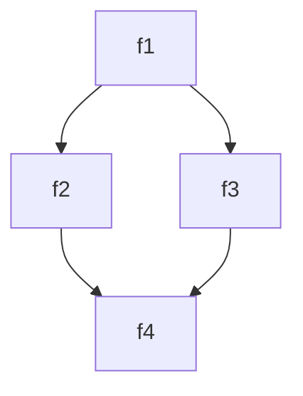

# Test declarations

_Developed in `VS Code` with the `bierner.markdown-mermaid` extension._

<!-- See Parse-Mermaid.ps1 for formatting guidance and limitations -->

## Diamond



```
> 'f1' | Find-Call

CommandType Name   Version Source
----------- ----   ------- ------
Function    f1     0.0     Diamond
Function      f2   0.0     Diamond
Function        f4 0.0     Diamond
Function      f3   0.0     Diamond
Function        f4 0.0     Diamond
```

```
> 'f4' | Find-Caller -Module Diamond

CommandType Name   Version Source
----------- ----   ------- ------
Function    f4     0.0     Diamond
Function      f2   0.0     Diamond
Function        f1 0.0     Diamond
Function      f3   0.0     Diamond
Function        f1 0.0     Diamond
```
