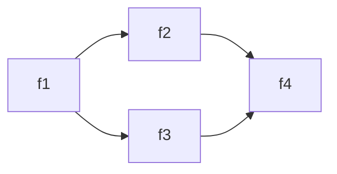
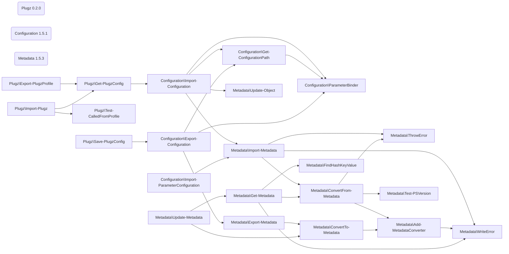

# Test declarations

_Developed in `VS Code` with the `bierner.markdown-mermaid` extension._

<!-- See Parse-Mermaid.ps1 for formatting guidance and limitations -->

## Diamond



```
> 'f1' | Find-Call

CommandType Name   Version Source
----------- ----   ------- ------
Function    f1     0.0     Diamond
Function      f2   0.0     Diamond
Function        f4 0.0     Diamond
Function      f3   0.0     Diamond
Function        f4 0.0     Diamond
```

```
> 'f4' | Find-Caller -Module Diamond

CommandType Name   Version Source
----------- ----   ------- ------
Function    f4     0.0     Diamond
Function      f2   0.0     Diamond
Function        f1 0.0     Diamond
Function      f3   0.0     Diamond
Function        f1 0.0     Diamond
```

## Three Modules



```
> Find-Call Import-Plugz -Depth 5

CommandType Name                            Version Source
----------- ----                            ------- ------
Function    Import-Plugz                    0.2.0   Plugz
Function      Get-PlugzConfig               0.2.0   Plugz
Function        Import-Configuration        1.5.1   Configuration
Function          Get-ConfigurationPath     1.5.1   Configuration
Function            ParameterBinder         1.5.1   Configuration
Function          Import-Metadata           1.5.3   Metadata
Function            ConvertFrom-Metadata    1.5.3   Metadata
Function              Add-MetadataConverter 1.5.3   Metadata
Function              Test-PSVersion        1.5.3   Metadata
Function              ThrowError            1.5.3   Metadata
Function            ThrowError              1.5.3   Metadata
Function            WriteError              1.5.3   Metadata
Function          ParameterBinder           1.5.1   Configuration
Function          Update-Object             1.5.3   Metadata
Function      Test-CalledFromProfile        0.2.0   Plugz
```
